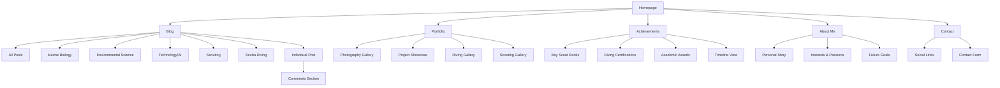
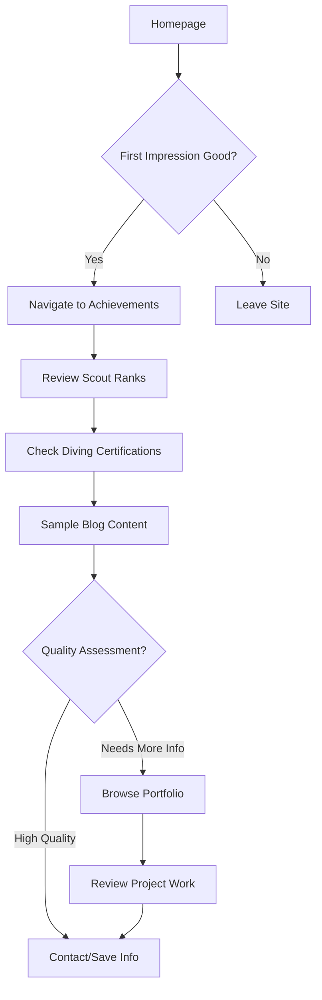

# RM Connected Personal Website UI/UX Specification

This document defines the user experience goals, information architecture, user flows, and visual design specifications for RM Connected Personal Website's user interface. It serves as the foundation for visual design and frontend development, ensuring a cohesive and user-centered experience.

## Overall UX Goals & Principles

### Target User Personas

**Scholarship Committees & Program Directors:** Need to quickly assess qualifications and maturity for educational opportunities and program admissions.

**Fellow Students & Scouts:** Want engaging, authentic content about shared interests in marine biology, environmental science, scouting, and outdoor activities.

**General Public/Educators:** Seeking educational content about marine biology and environmental science from a young, credible perspective.

### Usability Goals

- First-time visitors can understand your expertise and interests within 30 seconds of homepage visit
- Scholarship reviewers can find key achievements and qualifications within 2 clicks
- Blog readers can discover content by topic and engage through comments easily
- Mobile users get full functionality with touch-optimized photo galleries

### Design Principles

1. **Authentic Young Explorer** - Showcase real experiences over generic content
2. **Professional Yet Approachable** - Balance credibility with authentic teenage voice
3. **Visual Storytelling** - Let photography and real experiences guide the narrative
4. **Ocean-Adventure Aesthetic** - Consistent blue/white/tan palette reflecting diving passion
5. **Accessible by Design** - WCAG AA compliance for inclusive access

### Change Log

| Date | Version | Description | Author |
|------|---------|-------------|---------|
| 2025-08-08 | 1.0 | Initial UI/UX specification creation | Sally (UX Expert) |

## Information Architecture (IA)

### Site Map / Screen Inventory

### Navigation Structure

**Primary Navigation:** Fixed header with logo, main sections (Blog, Portfolio, Achievements, About, Contact), and search icon

**Secondary Navigation:** 
- Blog: Category filtering sidebar/dropdown (Marine Biology, Environmental Science, Technology/AI, Scouting, Scuba Diving)
- Portfolio: Photo gallery filters (Diving, Scouting, Projects, Nature)
- Achievements: Timeline/Badge view toggle

**Breadcrumb Strategy:** Simple breadcrumbs for deep content (Home > Blog > Marine Biology > [Post Title]) with category context

## User Flows

### Primary User Flow 1: Scholarship Committee Review

**User Goal:** Quickly assess student qualifications and achievements for scholarship/program consideration

**Entry Points:** Homepage via search results, direct link from application

**Success Criteria:** Find key achievements, assess maturity/expertise, determine fit within 5 minutes

#### Flow Diagram

#### Edge Cases & Error Handling:
- Missing achievement dates → Clear "In Progress" or "Date TBD" indicators
- Broken portfolio links → Fallback descriptions and alternative proof
- Mobile viewing → Touch-optimized achievement timeline
- Slow loading → Progressive loading with key info first

**Notes:** This flow prioritizes quick credibility assessment with clear achievement documentation and easy access to supporting evidence.

## Wireframes & Mockups

**Primary Design Files:** [To be created in Figma - RM Connected UI Kit]

### Key Screen Layouts

#### Homepage/Landing
**Purpose:** Immediately establish credibility and personality through authentic diving/scouting photography

**Key Elements:**
- Hero carousel featuring your best underwater and scouting photos
- Brief introduction with key achievements (Scout rank, diving cert, academic interests)
- Recent blog post previews with category tags
- Social proof section (certifications, awards) with visual badges

**Interaction Notes:** Photo carousel auto-advances, hover states reveal photo captions, smooth scroll to content sections

**Design File Reference:** [To be created - homepage-hero-v1]

#### Blog Post Detail
**Purpose:** Showcase rich multimedia content with your photography integrated throughout

**Key Elements:**
- Large featured image (your photography) with overlay title
- Reading progress indicator
- Embedded YouTube videos and image galleries
- Category tags and related posts
- Comment section with GitHub authentication

**Interaction Notes:** Lazy loading for media, expandable image galleries, smooth scrolling navigation

**Design File Reference:** [To be created - blog-post-layout-v1]

#### Portfolio Gallery
**Purpose:** Professional showcase of diving and scouting photography with metadata

**Key Elements:**
- Masonry/grid layout with category filters
- Lightbox modal for full-size viewing
- Image metadata (location, date, diving depth)
- Touch gestures for mobile navigation

**Interaction Notes:** Filter animations, smooth lightbox transitions, mobile-optimized touch controls

**Design File Reference:** [To be created - portfolio-gallery-v1]

## Component Library / Design System

**Design System Approach:** Creating a custom lightweight design system built on Tailwind CSS with ocean-inspired utilities. This approach balances design consistency with development efficiency for a single-person project while supporting future growth.

### Core Components

#### Navigation Header
**Purpose:** Consistent site navigation with search and responsive mobile menu

**Variants:** Desktop (horizontal), Mobile (hamburger menu), Sticky (reduced height)

**States:** Default, Active page, Hover, Search active, Mobile expanded

**Usage Guidelines:** Always fixed position, search icon on right, logo links to home

#### Photo Card
**Purpose:** Consistent presentation of your diving/scouting photography across site sections

**Variants:** Small (blog previews), Medium (gallery grid), Large (featured), Full (lightbox)

**States:** Loading skeleton, Error fallback, Hover with metadata, Selected

**Usage Guidelines:** Always include alt text, lazy load, show metadata on hover

#### Blog Post Preview
**Purpose:** Engaging preview cards for blog content with your photography

**Variants:** Horizontal (mobile), Vertical (desktop grid), Featured (homepage hero)

**States:** Default, Hover (lift effect), Loading, No image fallback

**Usage Guidelines:** Featured image required, category tag prominent, 2-line title truncation

#### Achievement Badge
**Purpose:** Visual representation of Scout ranks, diving certifications, awards

**Variants:** Scout (hexagonal), Diving (circular), Academic (shield), Timeline (connected)

**States:** Earned (full color), In Progress (outline), Locked (grayscale)

**Usage Guidelines:** Include completion date, link to detail view, accessible descriptions

#### Content Filter
**Purpose:** Category and tag filtering for blog and portfolio content

**Variants:** Horizontal pills, Dropdown (mobile), Sidebar (desktop)

**States:** Default, Active, Hover, Disabled (no content)

**Usage Guidelines:** Show content count, smooth transitions, clear active state

## Branding & Style Guide

### Visual Identity
**Brand Guidelines:** Ocean-adventure aesthetic reflecting authentic diving and scouting experiences with contemporary beach house meets scientific journal styling. Balances 60% casual/40% formal tone for peer engagement while maintaining scholarship application credibility.

### Color Palette
| Color Type | Hex Code | Usage |
|------------|----------|--------|
| Primary | #0284C7 | Ocean blue - primary CTA buttons, links, active states |
| Secondary | #0EA5E9 | Lighter ocean blue - hover states, secondary elements |
| Accent | #F59E0B | Sandy tan/amber - highlights, achievements, warm accents |
| Success | #10B981 | Positive feedback, certifications earned, confirmations |
| Warning | #F59E0B | Important notices, cautions (shares accent color) |
| Error | #EF4444 | Error states, validation messages, destructive actions |
| Neutral | #64748B, #F8FAFC, #1E293B | Text hierarchy, borders, backgrounds |

### Typography

#### Font Families
- **Primary:** Inter (clean, readable, modern - perfect for web)
- **Secondary:** Merriweather (serif for blog content, adds warmth)
- **Monospace:** JetBrains Mono (for any technical content/code)

#### Type Scale
| Element | Size | Weight | Line Height |
|---------|------|---------|-------------|
| H1 | 3rem (48px) | 700 | 1.2 |
| H2 | 2.25rem (36px) | 600 | 1.3 |
| H3 | 1.875rem (30px) | 600 | 1.4 |
| Body | 1rem (16px) | 400 | 1.6 |
| Small | 0.875rem (14px) | 400 | 1.5 |

### Iconography
**Icon Library:** Heroicons (fits Tailwind ecosystem, consistent style, comprehensive coverage)

**Usage Guidelines:** Outline style for secondary actions, solid style for primary actions and active states. Ocean-themed custom icons for diving/scouting achievements.

### Spacing & Layout
**Grid System:** CSS Grid with Tailwind's grid utilities - 12-column base with flexible content areas

**Spacing Scale:** Tailwind's default scale (0.25rem increments) with custom ocean-inspired spacing for photo layouts

## Accessibility Requirements

### Compliance Target
**Standard:** WCAG 2.1 AA compliance with specific focus on educational content accessibility and mobile optimization for teenage users.

### Key Requirements

**Visual:**
- Color contrast ratios: 4.5:1 minimum for normal text, 3:1 for large text and non-text elements
- Focus indicators: Visible 2px outline with 0.125rem offset, using primary blue (#0284C7)
- Text sizing: Minimum 16px base font, user can zoom to 200% without horizontal scroll

**Interaction:**
- Keyboard navigation: Full site accessible via Tab, Enter, Space, Arrow keys with logical focus order
- Screen reader support: Semantic HTML5, ARIA labels for complex interactions, image alt text for all photography
- Touch targets: Minimum 44x44px touch areas, adequate spacing between interactive elements

**Content:**
- Alternative text: Descriptive alt text for all diving/scouting photography including context and educational value
- Heading structure: Logical H1-H6 hierarchy, single H1 per page, no skipped levels
- Form labels: Explicit labels for all form inputs including search and comment forms

### Testing Strategy
Regular testing with screen readers (NVDA, JAWS, VoiceOver), keyboard-only navigation testing, color blindness simulation, and mobile accessibility testing with real devices. Focus on ensuring your photography content is fully accessible through detailed alt descriptions.

## Responsiveness Strategy

### Breakpoints
| Breakpoint | Min Width | Max Width | Target Devices |
|------------|-----------|-----------|----------------|
| Mobile | 320px | 767px | Phones, small tablets in portrait |
| Tablet | 768px | 1023px | iPads, tablets in landscape, small laptops |
| Desktop | 1024px | 1439px | Standard laptops, desktop monitors |
| Wide | 1440px | - | Large monitors, ultrawide displays |

### Adaptation Patterns

**Layout Changes:** Mobile: single column stack, photography in vertical galleries; Tablet: 2-column grid for blog previews, side-by-side portfolio layout; Desktop: 3-column grids, horizontal photo carousels; Wide: expanded whitespace, larger typography scale

**Navigation Changes:** Mobile: hamburger menu with full-screen overlay; Tablet: horizontal menu with dropdowns; Desktop: full horizontal navigation with mega-menu for blog categories; Wide: expanded navigation with category previews

**Content Priority:** Mobile: featured image, title, key achievement badges first; Tablet: add brief descriptions and metadata; Desktop: full content with sidebar information; Wide: enhanced spacing and larger imagery showcase

**Interaction Changes:** Mobile: touch gestures for photo galleries, swipe navigation; Tablet: hybrid touch and hover states; Desktop: hover effects and keyboard shortcuts; Wide: enhanced hover states with detailed overlays

## Animation & Micro-interactions

### Motion Principles
**Ocean-inspired fluidity** - Animations should feel like gentle ocean currents and underwater movement, never jarring or overwhelming. **Performance-first approach** - All animations optimized for mobile devices and slower connections. **Purposeful enhancement** - Motion supports content discovery and provides feedback, never decorative distraction. **Accessibility respect** - All animations can be disabled via prefers-reduced-motion for users with vestibular disorders.

### Key Animations
- **Photo Gallery Transitions:** Smooth fade-in as images load, gentle scale on hover (Duration: 300ms, Easing: ease-out)
- **Navigation State Changes:** Menu slide animations with ocean-wave easing (Duration: 250ms, Easing: cubic-bezier(0.4, 0.0, 0.2, 1))
- **Scroll Reveal Content:** Blog posts and achievements fade up as they enter viewport (Duration: 400ms, Easing: ease-out)
- **Achievement Badge Animations:** Gentle pulse when earned badges are viewed (Duration: 600ms, Easing: ease-in-out)
- **CTA Button Interactions:** Subtle lift effect on hover with color transition (Duration: 200ms, Easing: ease-out)
- **Search Interface:** Smooth expand/collapse with focus indicator growth (Duration: 300ms, Easing: ease-in-out)
- **Comment System:** Gentle slide-in for new comments with success feedback (Duration: 350ms, Easing: ease-out)
- **Loading States:** Ocean-wave loading animation for content and image placeholders (Duration: 1200ms, Easing: ease-in-out, infinite)

## Performance Considerations

### Performance Goals
- **Page Load:** Under 2 seconds for homepage on 3G connection, under 1 second on broadband
- **Interaction Response:** All UI interactions respond within 100ms, smooth 60fps animations
- **Animation FPS:** Consistent 60fps for all animations, graceful degradation on older devices

### Design Strategies
**Image Optimization Priority** - Use Astro's built-in image optimization with WebP/AVIF formats, responsive image sizing, lazy loading for all photography below fold. **Critical Path Focus** - Inline critical CSS, preload hero images, defer non-essential JavaScript for fastest first meaningful paint. **Progressive Enhancement** - Core content and navigation work without JavaScript, enhanced features load progressively. **Mobile-First Performance** - Optimize for mobile devices first, then enhance for desktop rather than scaling down.

## Next Steps

### Immediate Actions
1. Review this specification with key stakeholders (parents, mentors, teachers) for feedback
2. Create detailed visual designs in Figma based on these wireframes and component specifications
3. Set up Astro development environment with Tailwind CSS and TypeScript configuration
4. Begin component library development starting with navigation and photo card components
5. Prepare photography assets for web optimization and organize content for migration

### Design Handoff Checklist
- [x] All user flows documented
- [x] Component inventory complete
- [x] Accessibility requirements defined
- [x] Responsive strategy clear
- [x] Brand guidelines incorporated
- [x] Performance goals established

---

*Document generated through interactive UX specification workflow by Sally (UX Expert) on 2025-08-08*